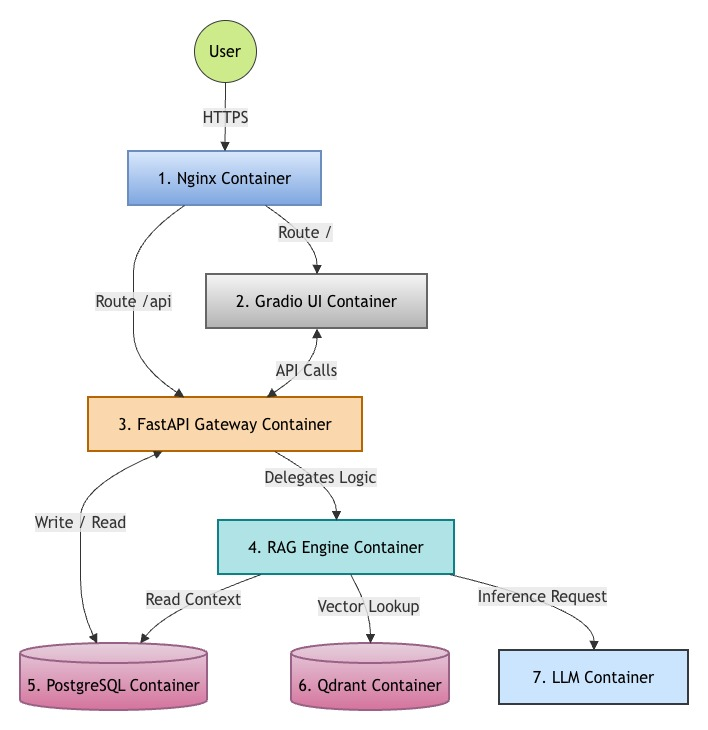
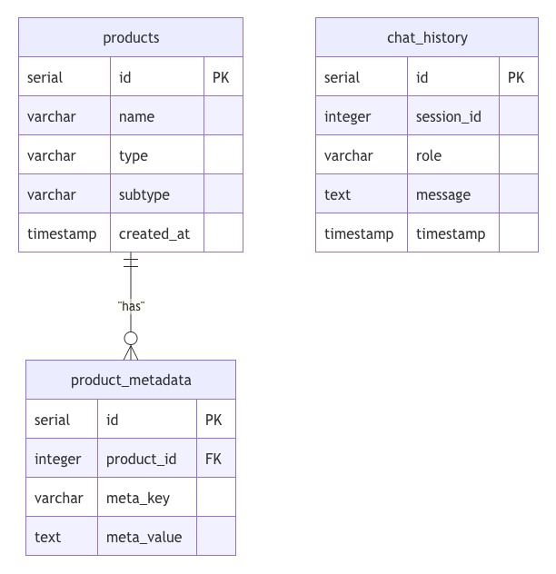

# E-Commerce AI System

A scalable, production-grade e-commerce shopping assistant powered by an **Agentic RAG** architecture. Built on a microservices architecture with independent services for the UI, API Gateway, AI orchestration, vector search, and LLM inference. The agent autonomously decides which tools to call (product search, calculator) based on the user's query.

## 🏗️ System Architecture



The UI, API Gateway, and AI logic are fully decoupled so each service can scale independently without creating bottlenecks. The API Gateway manages session logging and request routing, while the RAG Engine orchestrates context retrieval and AI response generation.

### Core Components (7-Container Stack)

1. **Nginx** — Reverse proxy for routing and load balancing (port 80).
2. **Frontend (Gradio 6+)** — Chat-based shopping UI.
3. **Backend (FastAPI)** — API Gateway that handles session management, request delegation, and product data hydration.
4. **PostgreSQL 17** — Persistent storage for the product catalog, metadata, and chat logs.
5. **RAG Engine** — LangGraph ReAct Agent with tool-calling capabilities for autonomous product search and calculations.
6. **Qdrant** — High-performance vector database for semantic product search.
7. **Ollama** — Hardware-agnostic LLM inference engine running **Llama 3.2** (local mode).

---

## 📂 Project Structure

```text
ECommerceAI/
├── docker-compose.yml        # Orchestration for the 7-container stack
├── Makefile                  # Helper commands for local development
├── .env                      # Environment variables (localhost defaults)
├── frontend/                 # Gradio Chat UI
├── backend/                  # FastAPI API Gateway
│   └── app/
│       ├── main.py           #   Route handlers and RAG Engine delegation
│       ├── database.py       #   SQLAlchemy engine and session factory
│       ├── models.py         #   ORM models (Product, ProductMetadata, ChatHistory)
│       ├── schemas.py        #   Pydantic request/response schemas
│       └── repositories.py   #   Database query layer
├── rag_engine/               # RAG Engine (AI Brain)
│   ├── app/
│   │   ├── main.py           #   FastAPI server exposing /rag/query
│   │   ├── config.py         #   Environment-based configuration
│   │   ├── hardware.py       #   CUDA / MPS / CPU auto-detection
│   │   ├── graph.py          #   LangGraph ReAct agent builder
│   │   ├── tools.py          #   Agent tools (product search, calculator)
│   │   └── clients/          #   Service clients (Qdrant, Postgres, LLM factory)
│   └── scripts/
│       └── sync_vectors.py   #   Syncs product data from Postgres → Qdrant
├── nginx/                    # Nginx configuration
└── docs/                     # Architecture diagrams
```

---

## 🚀 Getting Started

### Prerequisites

- **Docker & Docker Compose**
- **Python 3.12+** (for local commands and tests)
- **Poetry** (for dependency management)
- **Groq API Key** _(optional, free at [console.groq.com](https://console.groq.com))_ — for cloud LLM mode

### Makefile Commands

```bash
make up              # Build and start all 7 containers
make down            # Stop all containers (preserves volumes)
make build           # Rebuild Docker images
make test            # Run the backend test suite
make migrate         # Run Alembic database migrations
make seed            # Seed the database with sample products
make sync-vectors    # Sync product vectors from Postgres to Qdrant (locally)
```

### Initial Setup

1. **Start the containers:**

   ```bash
   make up
   ```

   _The backend automatically runs database migrations on startup._

2. **Seed the database:**

   ```bash
   make seed
   ```

3. **Sync product vectors to Qdrant:**

   ```bash
   make sync-vectors
   ```

4. **Open the application:**
   - **Chat UI:** [http://localhost](http://localhost)
   - **API Docs:** [http://localhost/api/docs](http://localhost/api/docs)

---

## 🤖 Agentic RAG Pipeline

The RAG Engine uses a [LangGraph](https://langchain-ai.github.io/langgraph/) **ReAct Agent** that autonomously decides which tools to call based on the user's query:

```
User Query → [ReAct Agent] ⟳ [Tool Calls] → {ai_response, product_ids}
                  ↕                ↕
          Decides action    Executes tool
          Observes result   Loops if needed
```

### Agent Tools

| Tool                    | What it does                                                                                                  |
| ----------------------- | ------------------------------------------------------------------------------------------------------------- |
| **product_search_tool** | Embeds the query → searches Qdrant with metadata filters → falls back to Postgres SQL → returns product list  |
| **calculator_tool**     | Safely evaluates mathematical expressions (discounts, totals, tax, comparisons)                               |

### Dynamic LLM Selection

The frontend provides a dropdown to switch between LLM providers at runtime. These labels are configured dynamically via the `.env` file:

| Provider                | Model           | Notes                                           |
| ----------------------- | --------------- | ----------------------------------------------- |
| **Local (Llama 3.2)**   | Meta Llama 3.2  | Runs on Ollama inside Docker, no API key needed |
| **Cloud (Groq Llama 3.1)** | Meta Llama 3.1 8B | Free cloud API via Groq, requires API key       |

### Performance Optimizations

- **LRU Caching:** High-cost operations such as querying the HuggingFace embedding model in the `product_search_tool` and instantiating LangChain LLM classes are memory-cached via `@lru_cache`, drastically improving speed on repeated queries.
- **Failover Mechanisms:** If `Qdrant` goes offline, the agent explicitly catches the exception and falls back to searching via the `PostgreSQL` instance gracefully.

---

## 🗄️ Database Schema

The schema is managed with **Alembic** migrations and defined in **SQLAlchemy** ORM models ([models.py](./backend/app/models.py)).



| Table                | Purpose                                                         |
| -------------------- | --------------------------------------------------------------- |
| **products**         | Core product catalog with category type and subtype.            |
| **product_metadata** | Flexible key-value pairs (brand, price, color, specs, etc.).    |
| **chat_history**     | Conversation log keyed by UUID session ID for history playback. |

---

## ⚙️ Hardware Agnostic

The system automatically detects and uses the best available compute hardware:

| Environment            | Compute | Notes                               |
| ---------------------- | ------- | ----------------------------------- |
| NVIDIA GPU (Docker)    | CUDA    | Requires `nvidia-container-toolkit` |
| Apple Silicon (native) | MPS     | For local execution outside Docker  |
| Apple Silicon (Docker) | CPU     | Docker runs ARM64 Linux, no Metal   |
| Intel/AMD              | CPU     | Universal fallback                  |

---

## 🛠️ Tech Stack

| Layer           | Technology                                      |
| --------------- | ----------------------------------------------- |
| Frontend        | Gradio 6+                                       |
| API Gateway     | FastAPI, SQLAlchemy, Alembic                    |
| RAG Engine      | LangGraph, LangChain Core, Sentence-Transformers|
| LLM (Local)     | Ollama (Llama 3.2 3B)                           |
| LLM (Cloud)     | Groq API (Llama 3.1 8B)                         |
| Database        | PostgreSQL 17                                   |
| Vector Database | Qdrant                                          |
| Dependencies    | Poetry                                          |
| Infrastructure  | Docker, Nginx, Make                             |

---
